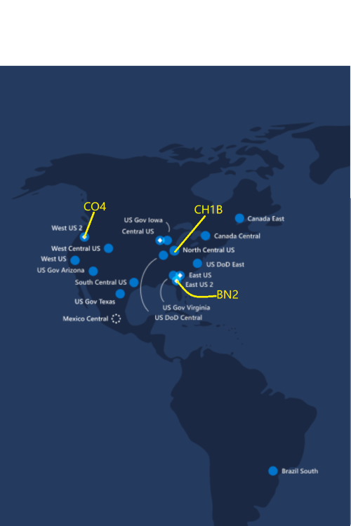

# API Gateway

### Supported API Gateway List({apigw} domain name)

The service is deployed in data centers in different geographic locations, all entrances have the same functionality.
You can choose the nearest entrance to reduce the latency. If you're not sure which entrance is nearest or don't care much about the latency, you can choose CH1B as the default entrance. If you are in corpnet you can use short name to access the service or you should use FQDN name.

| Cluster Name | Region | Location | Short Domain Name | FQDN Name | Status |
| :---------- | :------  | :------ | :------  | :------ | :------ |
| CH1B        | North Central US  |  Chicago, IL  | mt-ch1b/mt-api        | apigw-ivip.yarn-prod-ch1b.ch1b.ap.gbl | Ready |
| CO4         | West US 2  | Quincy, WA   | mt-co4        | apigw-ivip.yarn-prod-co4.co4.ap.gbl | Ready |
| BN2         | East US 2  |  Boydton, VA  | mt-bn2        | apigw-ivip.yarn-prod-bn2.bn2.ap.gbl | Ready |
| BN1-Dev    | East US 2  |  Boydton, VA  |          | apigw-ivip.yarn3-dev-bn1.bn1.ap.gbl | Ready |
| CH1-Int    |  North Central US |  Chicago, IL  |          | apigw-ivip.yarn-prod-ch1.ch1.ap.gbl | Ready |

 *Note: BN1-Dev/CH1-Int is for internal test only
 
 

### API Gateway Supported Service API(replace {apigw} with the domain name or short domain name in the list above  )

| Service Name | URI | Required Parameter | Example | Specific API Reference |
| :---------- | :- | :---------------- | :----- | :----- |
| MT Rest Service | https://{apigw}:4431/api/ | subcluster | https://apigw-ivip.yarn3-dev-bn1.bn1.ap.gbl:4431/api/v1/jobs?subcluster=BASIC-PROD-CO4-0 | [API.md](../../../docs/rest-server/MT/JobAPIReadme.md)
| MT Livy Service | https://{apigw}:4432/[batches\|sessions] | subcluster | https://apigw-ivip.yarn3-dev-bn1.bn1.ap.gbl:4432/batches?subcluster=BASIC-PROD-CO4-0 | [REST API](http://livy.incubator.apache.org/docs/latest/rest-api.html)
| MT Launcher Service | https://{apigw}:4433/v1/ | subcluster | https://apigw-ivip.yarn3-dev-bn1.bn1.ap.gbl:4433/v1/Frameworks?subcluster=BASIC-PROD-CO4-0 | [FrameworkLauncher](https://mtpwiki.azurewebsites.net/use/FrameworkLauncher.html)
| MT Login Service | https://{apigw}:4434/api/v1/authn/ |   | https://apigw-ivip.yarn3-dev-bn1.bn1.ap.gbl:4434/api/v1/authn/oidc/login | [API.md](../../../docs/rest-server/API.md)
| MT yarn resource manager Service | https://{apigw}:4435/ws/v1/cluster | subcluster | https://apigw-ivip.yarn3-dev-bn1.bn1.ap.gbl:4435/ws/v1/cluster/info?subcluster=BASIC-PROD-CO4-0 | [API.md](https://hadoop.apache.org/docs/stable/hadoop-yarn/hadoop-yarn-site/ResourceManagerRest.html)
| MT spark job history Service | https://{apigw}:4437/api/v1/ | subcluster | https://apigw-ivip.yarn3-dev-bn1.bn1.ap.gbl:4437/api/v1/version?subcluster=BASIC-PROD-CO4-0 | [API.md](https://spark.apache.org/docs/2.1.0/monitoring.html)


### API Gateway Reserved Sub Cluster Parameter Key=subcluster(ignorecase), Supported Value List(ignorecase)
| Sub Cluster | Value |
| :---------- | :---------- |
| Yarn3-Dev-Bn1 sub 0         |BASIC-DEV-BN1-0       |
| Yarn3-Dev-Bn1 sub 1         |BASIC-DEV-BN1-1       |
| Yarn-Prod-Ch1 sub 0         |BASIC-PROD-CH1-0      |
| Yarn-Prod-Ch1 sub 1         |BASIC-PROD-CH1-1      |
| Yarn-Prod-Co4 sub 0         |BASIC-PROD-CO4-0      |
| Yarn-Prod-Co4 sub 1         |BASIC-PROD-CO4-1      |
| Yarn-Prod-Co4 sub 2         |BASIC-PROD-CO4-2      |
| Yarn-Prod-Co4 sub 3         |BASIC-PROD-CO4-3      |
| Yarn-Prod-Co4 sub 4         |BASIC-PROD-CO4-4      |
| Yarn-Prod-Co4 sub 5         |BASIC-PROD-CO4-5      |
| Yarn-Prod-Bn2 sub 0         |BASIC-PROD-BN2-0      |
| Yarn-Prod-Bn2 sub 1         |BASIC-PROD-BN2-1      |
| Yarn-Prod-Bn2 sub 2         |BASIC-PROD-BN2-2      |
| Yarn-Prod-Bn2 sub 3         |BASIC-PROD-BN2-3      |
| Yarn-Prod-Bn2 sub 4         |BASIC-PROD-BN2-4      |
| Yarn-Prod-Bn2 sub 5         |BASIC-PROD-BN2-5      |
| Yarn-Prod-Ch1b sub 0         |BASIC-PROD-CH1B-0         |
| Yarn-Prod-Ch1b sub 1         |BASIC-PROD-CH1B-1         |
| Yarn-Prod-Ch1b sub 2         |BASIC-PROD-CH1B-2         |
| Yarn-Prod-Ch1b sub 3         |BASIC-PROD-CH1B-3         |
| Yarn-Prod-Ch1b sub 4         |BASIC-PROD-CH1B-4         |
| Yarn-Prod-Ch1b sub 5         |BASIC-PROD-CH1B-5         |
| MTPrime-Prod-CO4 sub 0        |MTPrime-PROD-CO4-0         |
| MTPrime-Prod-CO4 sub 1        |MTPrime-PROD-CO4-1         |
| MTPrime-Prod-CO4 sub 2         |MTPrime-PROD-CO4-2         |
| MTPrime-Prod-CO4 sub 3         |MTPrime-PROD-CO4-3         |
| MTPrime-Prod-BN2 sub 0         |MTPrime-PROD-BN2-0         |
| MTPrime-Prod-BN2 sub 1         |MTPrime-PROD-BN2-1         |
| MTCmpl-Prod-CO4 sub 0         |MTCmpl-PROD-CO4-0         |

### API Gateway authentication

When access api gateway, you must use http header Authorization to carry the mttoken. Only a few requests for mtlogin server's login or logout request do not need to carry mttoken. Bellow is an example to submit job to mtrest service from api gateway.
HTTP POST the config file as json with access mttoken in Authorization header:
```
https://mt-api:4431/api/v1/user/username/jobs
```
you can execute below command line:
```sh
curl -H "Content-Type: application/json" \
     -H "Authorization: Bearer YOUR_ACCESS_TOKEN" \
     -X POST https://mt-api:4431/api/v1/user/username/jobs \
     -d @exampleJob.json
```

## Reference
For more information about mttoken, you can read [MT Token Doc](https://mtpwiki.azurewebsites.net/use/Authentication/Authentication.html)

